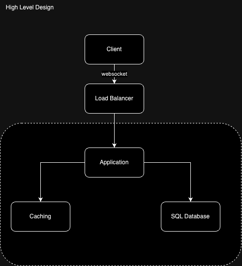
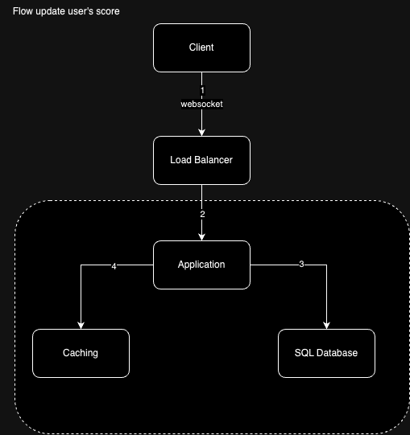
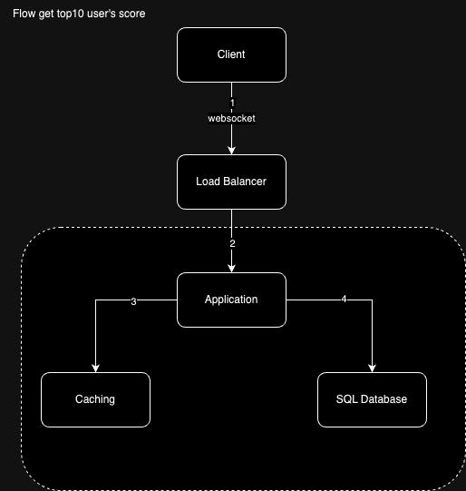

# Software Requirements

1. We have a website with a score board, which shows the top 10 user’s scores.
2. We want live update of the score board.
3. User can do an action (which we do not need to care what the action is), completing this action will increase the user’s score.
4. Upon completion the action will dispatch an API call to the application server to update the score.
5. We want to prevent malicious users from increasing scores without authorisation.

# Overview Solution

- Client connect to server by HTTP.
  </br>
- Websocket for asynchronously processing of score updates.
  </br>
- JWT to verify request update user's score.
  </br>
- Redis cache result top 10 user's score
  </br>
- RDBMS save score of all users.

# High Level Design



# Flow update user's score



1. The client creates a WebSocket connection to the load balancer for real-time communication.
2. The load balancer delegates the client’s request to the server.
3. The server updates the user's score record on the relational database.
4. The server updates top10 user's score on cache.

# Flow get Top10 user's scores



1. The client creates a WebSocket connection to the load balancer for real-time communication.
2. The load balancer delegates the client’s request to the server.
3. Ther server get top10 user's scores from cache.

# Apis

### 1. Update user's score:

url: host/api/users/{id}/score
</br>
method: Post
</br>
authorization: Bearer JWT
</br>
body: {score: number}

### 2. Get Top10 user's score:

url: host/api/users?limit=10&page=0&
</br>
order=score+asc
</br>
method: Get

# Design model

### Model table Relational Database

| id  | name     | score | created_at              | updated_at              |
| --- | -------- | ----- | ----------------------- | ----------------------- |
| 1   | Marcus   | 10    | 2024-07-28 22:00:00.000 | 2024-07-28 22:00:00.000 |
| 2   | Rashford | 20    | 2024-07-28 22:00:00.000 | 2024-07-28 22:00:00.000 |

### Value caching

```json
{
  "hash": "md5",
  "data": [
    { "id": 1, "rank": 1, "name": "Marcus", "score": 10 },
    { "id": 2, "rank": 2, "name": "Marcus", "score": 9 }
  ]
}
```

# Specification

### Logic update

- Authorize JWT before handle logic update.
- Every time update user's score need to get top10 user's scores and hash records to string md5 and compare with hash in cache.
  If it is same with cache skip update cache. If not update caching new value.
- Can use hooks of ORM to manage logic update cache every time update user's score or Kafka Connect and Kafka to receive event change database and consume message.
- Maybe need use message queue to manage task update caching sequentially.

### Logic handle api get Top10 user's score

- Get data from caching, get data from Relational Database when Cache not work.
